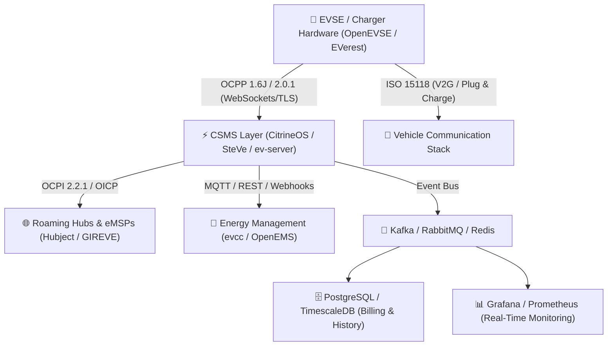

# ⚡ Awesome EV Charging Management Ecosystem 🚗🔋

  <strong>Curated Directory of Cloud SaaS CPMS, Open-Source CSMS, OCPP 1.6J/2.0.1/2.1, ISO 15118 (V2G/PnC), OCPI Roaming &amp; Smart Energy Optimization</strong>

     

  <em>Updated: August 2026 | Maintained for CPOs, eMSPs, Fleet Managers &amp; E-Mobility Software Engineers</em>

---

## 📖 Overview &amp; SEO Summary

Welcome to the definitive **EV Charging Management and E-Mobility Software Directory**. This repository tracks commercial **SaaS/hosted Charge Point Management Systems (CPMS)** and production-ready **Open-Source Charging Station Management Systems (CSMS)**. 

Whether you are building, operating, or scaling electric vehicle charging infrastructure, this guide covers essential protocols including **OCPP 1.6J / 2.0.1 / 2.1**, **ISO 15118 (Plug &amp; Charge / Vehicle-to-Grid V2G)**, **OCPI 2.2.1 / OICP (Roaming &amp; Clearing)**, **Dynamic Load Balancing (DLM)**, **Solar PV Surplus Charging**, and **Automated Billing Engines**.

---

## 📌 Table of Contents

- [🏢 SaaS / Hosted Platforms (Ranked by Scale)](#-saashosted-platforms)
- [💻 Open-Source GitHub Projects (Ranked by Stars)](#-open-source-github-projects)
- [🛠️ Additional Strong Open-Source Building Blocks](#️-additional-strong-open-source-building-blocks)
- [🏗️ Architectural Framework for Custom Platforms](#️-architectural-framework-for-custom-platforms)
- [🔍 E-Mobility Keywords &amp; SEO Index](#-e-mobility-keywords--seo-index)
- [🤝 How to Contribute](#-how-to-contribute)
- [📈 Star History](#-star-history)
- [⚖️ Disclaimer](#️-disclaimer)

---

## 🏢 SaaS/Hosted Platforms

The table below catalogs leading commercial EV Charging Station Management SaaS platforms, sorted in **descending order by company scale** (Market Capitalization, Annual Revenue, or Total Funding Raised).

| 🏢 Platform / Product | 💼 Company Scale (Valuation / Revenue) | 📝 Description | 💳 Starting Pricing | 🎁 Free Tier / Free Trial Limits |
| :--- | :--- | :--- | :--- | :--- |
| **[Siemens eMobility](https://www.siemens.com/)** | ~$285B Market Cap / ~$86B Revenue | Enterprise EV charging infrastructure and digital-management ecosystem (Sifinity Fleet / DepotFinity) for commercial, fleet, workplace, and public charging networks. | Sifinity Fleet / DepotFinity Basic tier starts at ~€15–€30/connector/month (scales up for dynamic load management and day-ahead market optimization). | Free basic driver mobile app; free live demo and 30-day proof-of-concept pilot for fleet/enterprise customers on request. |
| **[Shell Recharge Solutions](https://www.shell.com/mobility/electric-vehicle-charging.html)** | ~$257.6B Market Cap / ~$296.6B Revenue | Global EV charging management and infrastructure platform supporting public, workplace, fleet, and residential charging ecosystems. | Commercial/Business cloud management starts at ~€4–€8/socket/month (or €0 monthly for home app users with standard roaming transaction fees). | Free forever home charging app (Shell Recharge App for personal charging points); free commercial fleet &amp; site pilot consultation on request. |
| **[ABB E-mobility](https://www.abb.com/)** | ~$147.4B Market Cap / ~$33.2B Revenue | Global industrial charging infrastructure and digital software ecosystem supporting charger management, monitoring, fleet charging, and smart energy integration. | ChargerSync is €0/month for Terra AC hardware; enterprise ABB Ability Management Console starts at ~€12–€25/port/month for commercial networks. | Free forever ChargerSync app &amp; web portal for Terra AC wallboxes (manage up to 50 home/workplace chargers, scheduling, RFID, and energy statistics). |
| **[EV Connect](https://www.evconnect.com/)** | ~$140B Market Cap / ~$38B Revenue (Schneider Electric) | Comprehensive EV charging network management platform providing station operations, driver services, payments, monitoring, and energy management. | Starts at $120–$240/port/year (approx. $10–$20/port/month; bundled Software+ subscriptions available; also available via CaaS monthly plans). | 1-year free software subscription included with select certified hardware purchases (e.g., Schneider Charge Pro); free live demo on request. |
| **[Driivz](https://driivz.com/)** | ~$5.5B Market Cap / ~$3.2B Revenue (Vontier Corp) | Enterprise EV charging software platform supporting large-scale charging network management, billing, energy management, roaming, and smart charging. | Starts at ~$50–$67/port/month ($600–$800/port/year entry enterprise tier for network management). | No free forever plan; offers a free live interactive product demo and custom sandbox pilot upon request for utilities and large CPOs. |
| **[Alpitronic](https://www.alpitronic.it/)** | ~$4.0B Valuation / ~€1.0B+ Revenue | High-power DC fast-charging ecosystem (Hypercharger) backed by smart diagnostic tools, remote fleet monitoring, and open OCPP cloud integrations. | Open OCPP hardware stack; companion diagnostic monitoring or partner CSMS starting at ~€8–€15/charger/month (or freemium via eCarUp with 10% session fee). | Free local service and diagnostics software (Alpitronic Service Tool); free partner cloud tier available via eCarUp for basic management. |
| **[Electrify America](https://www.electrifyamerica.com/)** | ~$2.45B Valuation (Volkswagen Group / Siemens) | Ultra-fast DC public EV charging network with cloud software supporting charger operations, driver access, payments, and fleet management. | $7.00/month (Electrify America Pass+ subscription giving ~25% discount per kWh); Commercial fleet/site host custom agreements. | Free forever Pass tier (standard pay-as-you-go charging access, station discovery, and charger status monitoring with no monthly subscription fee). |
| **[GreenFlux](https://www.greenflux.com/)** | ~$2.0B Valuation / €1.8B+ Revenue (DKV Mobility) | Cloud-native EV charging management platform providing charge point operations, smart charging, roaming, billing, and energy optimization. | Starts at ~$5–$20/charge point/month (entry smart charging &amp; roaming management tier for CPOs and eMSPs). | Free driver roaming app access; CPO platform offers a free product demo and technical trial evaluation on request. |
| **[Kempower ChargEye](https://kempower.com/)** | ~€560M Market Cap / ~€251M Revenue (Nasdaq: KEMPOWR) | Cloud-based charging management and monitoring platform optimized for Kempower DC fast-charging systems, fleet depots, and public hubs. | Starts at ~€30–€50/charging station/month (cloud monitoring and dynamic power distribution platform for Kempower fast chargers). | Free basic local commissioning interface; free ChargEye cloud live demo and guided technical onboarding on request. |
| **[FLO](https://www.flo.com/)** | ~$500M Valuation / ~$200M+ Raised | Comprehensive North American EV charging network and software platform supporting station management, monitoring, driver apps, and fleet charging. | Starts at ~$24/port/month (commercial network management fee plus ~10% transaction processing fee). | Free forever FLO mobile app for personal charging stations &amp; public roaming; free site host consultation and demo on request. |
| **[Monta](https://monta.com/)** | ~€440M+ Valuation / ~€130M Raised | Integrated EV charging platform covering charge point management, payments, roaming, automated billing, and smart energy workflows. | Private/Home: €0/month; Commercial Pro plan starts at ~$4.95–$6.00/charge point/month (plus 10% transaction fee on pay-per-charge billing). | Free forever plan for up to 3 charge points across multiple locations via the Monta Charge app (includes basic smart charging and private access control). |
| **[Virta](https://www.virta.global/)** | ~$300M+ Valuation / ~€78M+ Revenue | Global EV charging platform supporting charging-network operations, automated billing, roaming, smart charging, and white-label e-mobility services. | Starts at ~€10–€20/charging point/month (entry CPO management package depending on connector volume and add-on modules). | Free forever driver app for public charging access and roaming; commercial CPO platform provides a free live product demo and guided technical walkthrough on request. |
| **[Fimer](https://www.fimer.com/)** | ~€250M+ Revenue | Connected EV charging infrastructure and management solutions for commercial, industrial, and residential energy environments. | Hardware-agnostic OCPP hardware; bundled companion software or partner CPMS starting at ~€5–€10/charger/month (e.g., via eCarUp / Fortum). | Free local configuration tools &amp; basic companion app; free CPMS tier available via partner integrations (e.g., eCarUp free tier with transaction fees). |
| **[ChargePoint](https://www.chargepoint.com/)** | ~$150M Market Cap / ~$415M Revenue (NYSE: CHPT) | Leading EV charging hardware and cloud ecosystem providing station management, driver services, fleet charging, and energy optimization. | Starts at $240–$300/port/year (approx. $20–$25/port/month prepaid on 1–5 year terms); Essential Cloud Plan for CPF50 starts at $0 upfront software fee (funded via driver session fees). | Free forever driver mobile app &amp; basic residential home charging management; free 30-day cloud trial/demo sandbox for commercial site hosts on request. |
| **[EVBox Everon](https://www.evbox.com/)** | ~€100M+ Revenue (ENGIE Group) | EV charging management software for operating charging stations and networks (transitioning to partner management platforms like Tap Electric and Blink). | Previously starting at ~€4.50–€6.00/connector/month (users transitioning to partner platforms like Tap Electric / Blink). | 30-day free trial on partner migration platforms (e.g., Tap Electric / Clenergy EV); basic home app was free for a single residential charger. |
| **[SWTCH Energy](https://swtchenergy.com/)** | ~$100M Valuation / ~$18M ARR ($56M Raised) | Intelligent EV charging management platform specialized for multi-unit residential buildings (MUDs), commercial properties, and fleets. | Starts at ~$15–$20/port/month (or bundled Charging-as-a-Service starting around $50/month including hardware, installation, and software). | Free driver app for tenant/workplace billing; commercial hosts get a free initial site survey &amp; software platform demo on request. |
| **[Blink Charging](https://blinkcharging.com/)** | ~$90M Market Cap / ~$125M Revenue (NASDAQ: BLNK) | Vertically integrated EV charging hardware and cloud network platform supporting station operations, payments, and fleet services. | Starts at $18–$25/port/month (Host-Owned Blink Network subscription) or $0/month upfront on Blink-Owned hybrid revenue-share model. | Free forever driver account &amp; mobile app; $0-cost host option via Blink-as-a-Service / revenue share plan; free host portal demo on request. |
| **[Wallbox (myWallbox)](https://www.wallbox.com/)** | ~$85M Market Cap / ~$164M Revenue (NYSE: WBX) | Smart EV charging and energy-management ecosystem providing connected AC/DC chargers, portal software, and dynamic load balancing. | Basic tier: €0/month; Standard/Business management tier starts at ~€4.50–€6.50/charger/month (or 5% transaction fee on pay-per-charge). | Free forever Basic plan for unlimited private chargers (includes group management, scheduling, automated locking, and energy stats); 30-day free trial for Business tier. |
| **[AMPECO](https://www.ampeco.com/)** | ~$70M+ Valuation / ~$13.9M ARR ($42.6M Raised) | White-label EV charging management platform enabling utilities, oil &amp; gas, and CPOs to launch and monetize charging networks at scale. | Starts at ~$10–$15/charger/month (tiered CPO platform pricing based on connector volume, plus one-time onboarding setup). | No self-service free tier; provides a free 1-on-1 live platform demo and custom proof-of-concept consultation upon request. |
| **[ev.energy](https://www.evenergy.io/)** | ~$60M+ Valuation / $33M Raised | Smart EV charging software and energy-management platform supporting connected charging infrastructure and utility demand-response. | Free core smart charging app; ev.energy SOLAR premium tier starts at £5/month or £50/year (commercial utility platform via custom contracts). | Free forever core plan for smart home EV charging &amp; utility reward programs; 30-day free trial for ev.energy SOLAR features. |
| **[ChargeLab](https://chargelab.co/)** | ~$50M+ Valuation / $20M+ Raised | Hardware-agnostic cloud platform providing charging station management, network operations, remote monitoring, payments, and OCPP integrations. | Level 2 AC: $25/port/month; DCFC Level 3: $50/port/month (10% off for 3-yr, 20% off for 5-yr commitment). Fleet plans start at $25/port/month. | Free forever plan for residential EV drivers via ChargeLab Rewards ($0 monthly fee, earns $0.10/kWh rewards); Commercial platform provides a free live guided product demo upon request. |
| **[Noodoe EV](https://www.noodoe.com/)** | ~$40M+ Valuation | Autonomous cloud OS for commercial EV charging networks, featuring automated error recovery, intelligent load balancing, and universal payment. | Starts at ~$15–$25/port/month for Noodoe EV OS cloud management (autonomous revenue generation, automated recovery, and load management). | Free driver web app (scan and pay without registration); 30-day sandbox pilot and free live demo for commercial operators. |
| **[AmpUp](https://www.ampup.io/)** | ~$30M+ Valuation / $15M+ Raised | Intelligent EV charging network software supporting commercial site management, fleet operations, dynamic pricing, and station monitoring. | Starts at ~$15–$20/port/month (or $180–$240/port/year for entry Commercial/Fleet Management software). | Free driver mobile app; 30-day free software trial / demo sandbox for site hosts and fleet managers. |
| **[ChargeHub](https://chargehub.com/)** | ~$25M+ Valuation (Mogile Technologies) | EV charging platform and driver roaming network providing charging-station discovery, network connectivity, and eMSP roaming clearance. | $4.29/month (ChargeHub Plus driver subscription waiving activation fees across 160k+ ports); B2B Passport Roaming starts at ~$50/month base integration fee. | Free forever basic tier (ChargeHub Map &amp; community app with access to search and basic payment routing across 120,000+ North American locations). |

---

## 💻 Open-Source GitHub Projects

The following curated open-source repositories provide complete CSMS platforms, embedded charger firmware, protocol libraries, and energy controllers. **Ranked in descending order by GitHub Stars.**

1. **[Home Assistant](https://github.com/home-assistant/core)**   
   ⚡ Open-source home automation platform featuring rich integrations for OCPP chargers, solar PV forecasting, dynamic electricity tariffs, vehicle telematics, and automated residential charging.

2. **[evcc](https://github.com/evcc-io/evcc)**   
   🔋 Extensible EV smart-charging and energy-management system focused on intelligent solar PV surplus charging, dynamic electricity tariffs (Tibber, Awattar), RFID access, and home battery coordination.

3. **[OpenEnergyMonitor emoncms](https://github.com/openenergymonitor/emoncms)**   
   📊 Comprehensive open-source web application for processing, logging, and visualizing real-time energy consumption, solar PV generation, and EV charging telemetry.

4. **[SteVe](https://github.com/steve-community/steve)**   
   🔌 Mature open-source Charging Station Management System (CSMS) supporting OCPP 1.2, 1.5, and 1.6 (JSON &amp; SOAP) with a Java Spring Boot backend, user management, and a web admin dashboard.

5. **[OCPP Python](https://github.com/mobilityhouse/ocpp)**   
   🐍 Python implementation of the Open Charge Point Protocol (OCPP 1.6J, 2.0.1, 2.1) maintained by The Mobility House for building custom CSMS backends, simulators, and charger controllers.

6. **[openWB Core](https://github.com/openWB/core)**   
   🚗 Open-source energy controller and EV charging manager for multi-chargepoint installations, solar surplus diverting, load management, and vehicle SoC integrations.

7. **[OpenEMS](https://github.com/OpenEMS/openems)**   
   🌱 Modular Open-Source Energy Management System coordinating EVSE charge points with solar inverters, battery storage (BESS), heat pumps, dynamic tariffs, and grid meters.

8. **[OpenEVSE Controller](https://github.com/OpenEVSE/open_evse)**   
   🛠️ Open-source firmware and hardware designs for AC Level 1 and Level 2 electric vehicle supply equipment (EVSE) with configurable safety logic and pilots.

9. **[Open e-Mobility / EV Server](https://github.com/sap-labs-france/ev-server)**   
   🏢 Enterprise-grade open-source EV Charging Station Management System built with Node.js and TypeScript, supporting multi-tenant charging networks, billing, RFID, OCPI, and smart charging.

10. **[Switch-EV / Josev ISO 15118](https://github.com/Switch-EV/iso15118)**   
    🌐 Python implementation of ISO 15118-2 and ISO 15118-20 standards enabling Vehicle-to-Grid (V2G), Plug &amp; Charge (PnC), TLS security, and bidirectional AC/DC charging communication.

11. **[OCPP Java (Java-OCA-OCPP)](https://github.com/ChargeTimeEU/Java-OCA-OCPP)**   
    ☕ Complete Java client and server library for OCPP 1.6 and 2.0.1, developed in compliance with Open Charge Alliance (OCA) specifications.

12. **[EVerest libocpp](https://github.com/EVerest/libocpp)**   
    ⚙️ C++ implementation of OCPP 1.6J and OCPP 2.0.1 for embedded EVSE controllers, supporting security profiles, smart charging, and certificate management within LF Energy EVerest.

13. **[CitrineOS Core](https://github.com/citrineos/citrineos-core)**   
    💎 The core runtime containing OCPP 1.6 and 2.0.1 routing, charging-station state machines, API server, persistence layer, messaging bus, and certificate management.

14. **[EVerest Framework](https://github.com/EVerest/EVerest)**   
    🌟 Linux Foundation Energy-backed complete open-source EV charging operating system supporting ISO 15118, IEC 61851, OCPP, energy management, OTA updates, and charger hardware abstraction.

15. **[Thoughtworks EPC V2G](https://github.com/thoughtworks/epc-v2g)**   
    🔋 Open-source Vehicle-to-Grid (V2G) and Electric Power Control simulation stack implementing ISO 15118 bidirectional charging standards for grid stabilization.

16. **[Micro-OCPP](https://github.com/micro-ocpp/micro-ocpp)**   
    💡 Ultra-lightweight C/C++ implementation of OCPP 1.6J and 2.0.1 designed specifically for embedded microcontrollers (ESP32, STM32, Arduino) and compact AC wallboxes.

17. **[CitrineOS Platform](https://github.com/citrineos/citrineos)**   
    🚀 Open-source, modular, microservices-based Charging Station Management System designed natively around OCPP 2.0.1 with device management, reservations, and authorization.

18. **[ChargePoint OCPP Library](https://github.com/chargepoint/ocpp)**   
    📦 Python package for validating and manipulating OCPP frames, JSON schemas, and protocol message sets for testing and server development.

19. **[OpenEVSE WiFi v2](https://github.com/OpenEVSE/ESP8266_WiFi_v2.x)**   
    📡 ESP8266 &amp; ESP32 WiFi/Ethernet gateway firmware for OpenEVSE chargers supporting MQTT, HTTP REST APIs, solar PV divert, and OCPP 1.6J connectivity.

20. **[Node OCPP](https://github.com/chaoo/node-ocpp)**   
    🟢 Lightweight NodeJS framework for building OCPP Central Systems (CSMS) and Charge Point clients using WebSockets and JSON schemas.

---

## 🛠️ Additional Strong Open-Source Building Blocks

- **Open OCPP Protocol Libraries** for building client/server implementations of OCPP 1.6J, OCPP 2.0.1, and OCPP 2.1.
- **Open CSMS Platforms** for managing chargers, transactions, users, authorization, dynamic tariffs, and charging sessions.
- **Open OCPI &amp; OICP Implementations** for e-roaming, tariff synchronization, and interoperability between CPOs and eMSPs.
- **Open ISO 15118 Implementations** for Plug &amp; Charge (PnC), bidirectional power transfer, and Vehicle-to-Grid (V2G).
- **Open EVSE Firmware** for building customizable AC/DC charging hardware.
- **Open Charging Simulators** for load testing charging stations and CSMS platforms without physical hardware.
- **Open Smart-Charging Algorithms** for dynamic load balancing, peak shaving, demand response, and solar optimization.
- **Open Energy Management Systems (EMS)** for coordinating EV charging with solar panels, batteries, heat pumps, and microgrids.
- **Open EV Fleet Depot Charging Tools** for depot schedule optimization, vehicle departure preconditioning, and telematics sync.
- **Open Charging Analytics &amp; Telemetry** for session tracking, charger uptime metrics, MTBF analysis, and revenue analytics.

---

## 🏗️ Architectural Framework for Custom Platforms

To build a production-grade, self-hosted EV charging network platform, consider combining the following modular components:

- **CSMS / CPMS Backend:** [CitrineOS](https://github.com/citrineos/citrineos) or [SteVe](https://github.com/steve-community/steve)
- **Charger Operating System &amp; Firmware:** [LF Energy EVerest](https://github.com/EVerest/EVerest) + [libocpp](https://github.com/EVerest/libocpp)
- **Vehicle-to-Grid &amp; Plug &amp; Charge:** [Switch-EV ISO 15118](https://github.com/Switch-EV/iso15118)
- **Energy Management &amp; Solar Divert:** [evcc](https://github.com/evcc-io/evcc) or [OpenEMS](https://github.com/OpenEMS/openems)
- **Data &amp; Event Infrastructure:** PostgreSQL / TimescaleDB + Redis + RabbitMQ / Apache Kafka
- **Observability:** Prometheus + Grafana for charger uptime, active power, and error code monitoring

---

## 🔍 E-Mobility Keywords &amp; SEO Index

`Electric Vehicle Charging Management` • `Charge Point Operator (CPO)` • `e-Mobility Service Provider (eMSP)` • `OCPP 1.6J / OCPP 2.0.1 / OCPP 2.1` • `ISO 15118 Plug & Charge` • `Vehicle-to-Grid (V2G)` • `OCPI 2.2.1 Roaming` • `CSMS (Charging Station Management System)` • `CPMS (Charge Point Management System)` • `Dynamic Load Balancing (DLB)` • `Solar PV Surplus Divert` • `EV Fleet Depot Electrification` • `Smart Charging Tariffs` • `OpenEVSE` • `LF Energy EVerest`

---

## 🤝 How to Contribute

1. Fork this repository.
2. Add or update entries in [`README.md`](README.md).
3. Ensure SaaS entries include verified starting pricing, free tier / trial limits, and company scale metrics.
4. Ensure open-source entries include a valid shields.io star badge linking to the repository stargazers page.
5. Submit a Pull Request with a concise summary of changes!

⭐ **Star this repository if you find it helpful for your EV charging journey!**

---

## 📈 Star History

---

## ⚖️ Disclaimer

- This repository is a **community-curated index** — not an endorsement of any particular vendor or software library.
- Commercial SaaS capabilities, product names, pricing tiers, and licensing models are subject to change by their respective providers.
- Always verify open-source licenses (MIT, Apache 2.0, GPL, EPL) before integrating into commercial products.
- Production EV charging infrastructure must comply with national electrical codes, cybersecurity standards, payment card industry standards (PCI-DSS), and regional grid interconnection regulations.

---

  <strong>⚡ Built for EV charging operators, CPOs, eMSPs, fleet managers, hardware manufacturers, and e-mobility software engineers worldwide. 🚗🔋</strong>

